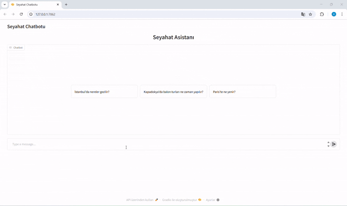

## Seyahat Chatbotu 

Seyahat Chatbotu, kullanıcıların destinasyonlar hakkında hızlı ve doğru öneriler almasını sağlayan RAG (Retrieval Augmented Generation) mimarisiyle geliştirilmiş akıllı bir sohbet asistanıdır. Sistem; gömülü seyahat bilgisini vektör veritabanında saklayarak, kullanıcının sorduğu soruya en uygun içeriği bulur ve Gemini LLM ile doğal bir dilde yanıt üretir.

Bu mimari, klasik chatbotlardan farklı olarak yalnızca ezberlenmiş bilgilerle değil; dinamik bağlam seçimi ile en uygun kaynağı getirerek cevap üretir. Kullanıcı aynı sohbet içinde peş peşe sorular sorduğunda önceki konuşma geçmişi de değerlendirilir.

---

## Uygulanan RAG Pipeline’ı

* **İçerik Hazırlama:** Seyahat bilgileri Türkçe metin olarak sisteme eklenir.
* **Chunking (Metin Parçalama):** Metin, bağlam bütünlüğünü koruyacak şekilde küçük parçalara ayrılır.
* **Embedding Oluşturma:** Her bölüm `paraphrase-multilingual-MiniLM-L12-v2` modeli ile semantik vektörlere dönüştürülür.
* **Vektör Depolama:** Embedding’ler ChromaDB veritabanında saklanır.
* **Sorgu Eşleştirme:** Kullanıcı sorusu embedding’e dönüştürülerek en benzer içerik geri çağrılır.
* **Cevap Üretimi:** Bağlam Gemini modeline aktarılır ve doğal Türkçe yanıt oluşturulur.

---

## Deploy Link

🚀 https://huggingface.co/spaces/esraozNk/travelBuddy

   


---

## Dataset

Bu uygulama, önceden hazırlanmış büyük bir veri kümesi kullanmak yerine; uygulama içinde tanımlı Türkçe seyahat bilgilerinden yararlanır. Bu bilgiler embedding’e dönüştürülerek ChromaDB’ye kaydedilir. İhtiyaç duyuldukça yeni destinasyon bilgileri eklenebilir.

---

## Özellikler

* **Türkçe Doğal Dil Desteği**
* **Akıllı Metin Parçalama(Chunking)**
* **Semantik Arama**
* **Bağlamsal Soru-Cevap**
* **Konuşma Geçmişi Desteği**
* **Genişletilebilir Mimari**

---

## Kullanım Senaryoları

* Tatil planı yapan kullanıcılar
* Bir şehirde gezilecek yerleri hızlıca öğrenmek isteyenler
* Turizm rehberliği sağlayan platformlar
* RAG mimarisi öğrenmek isteyen geliştiriciler
* Turizm odaklı yapay zeka uygulamaları

---

## Kullanılan Teknolojiler

| Bileşen            | Teknoloji                             |
| ------------------ | ------------------------------------- |
| Backend            | Python                                |
| Arayüz             | Gradio                                |
| LLM                | Gemini 2.5 Flash                      |
| Embedding Modeli   | paraphrase-multilingual-MiniLM-L12-v2 |
| Vektör DB          | ChromaDB                              |
| Retrieval Pipeline | LangChain benzeri yapı                |
| Dağıtım            | Lokal ortam + Hugging Face Spaces     |

---

## Dağıtım

Uygulama şu anda lokal geliştirme ortamında ve Hugging Face Spaces üzerinde deploy edilmiştir. Böylece kullanıcılar internet üzerinden herhangi bir kurulum yapmadan tarayıcı aracılığıyla chatbotu kullanabilmektedir.

---
# 🚀Seyahat Chatbotu Kurulum Rehberi

Bu rehber, **Seyahat Chatbotu** projesini bilgisayarınızda çalıştırmak için gerekli adımları içerir.

```bash
# 1️⃣ Depoyu Klonlayın
git clone https://github.com/Esraoznk30/travelChatbot.git
cd travelChatbot

# 2️⃣ Sanal Ortam Oluşturun ve Aktif Edin
# Windows
python -m venv venv
venv\Scripts\activate

# Linux / macOS
python -m venv venv
source venv/bin/activate

# 3️⃣ Gerekli Paketleri Yükleyin
pip install -r requirements.txt

# 4️⃣ API Anahtarını Ayarlayın (.env Dosyası)
# Proje kök dizininde .env dosyası oluşturun ve Google API anahtarınızı ekleyin
# ⚠️ Önemli: .env dosyası .gitignore içinde listelenmiş olmalı
echo "GOOGLE_API_KEY=senin_google_api_keyin" > .env

# 5️⃣ Uygulamayı Çalıştırın
python main.py

# 6️⃣ Tarayıcıda Erişin
# Tarayıcınızda aşağıdaki URL'yi açın:
   http://127.0.0.1:7860
